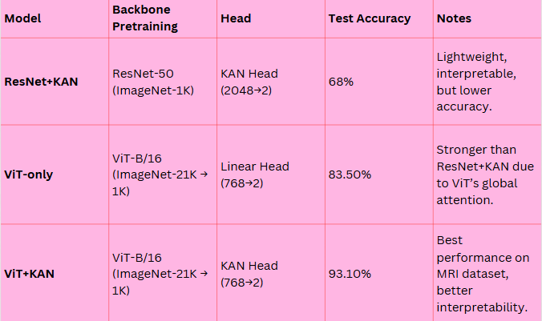
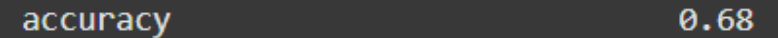
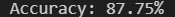
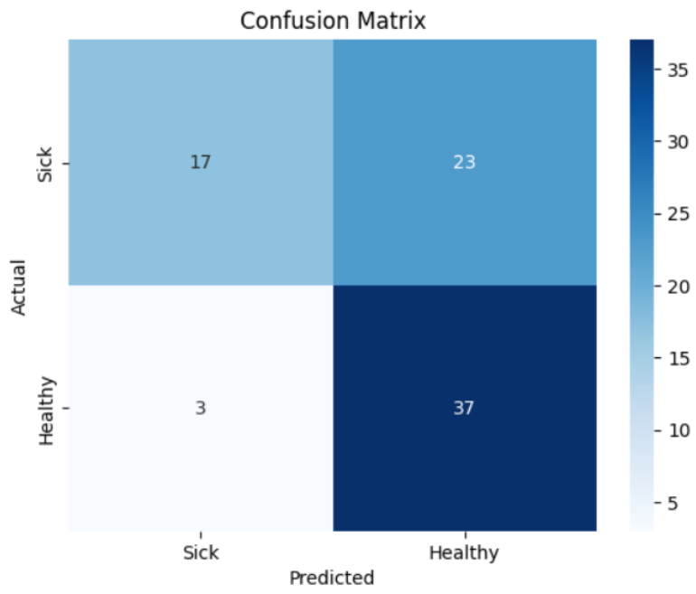
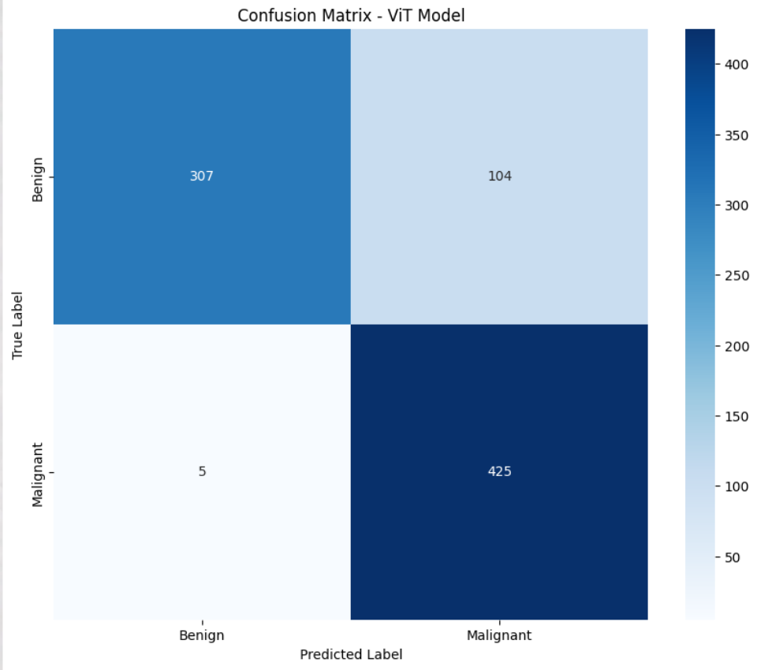
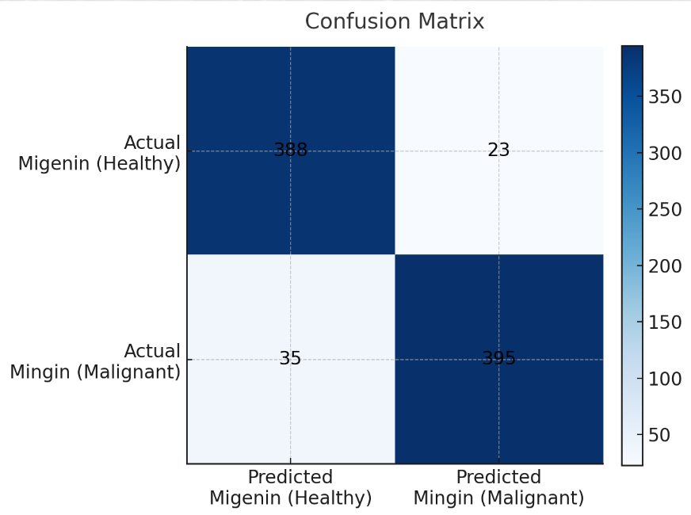
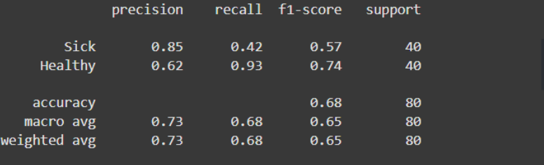
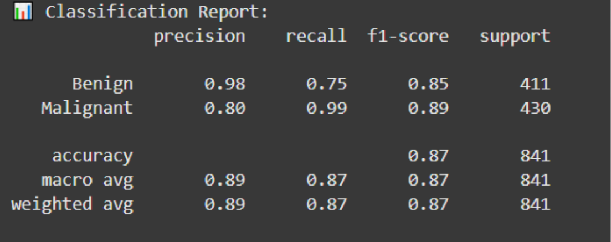
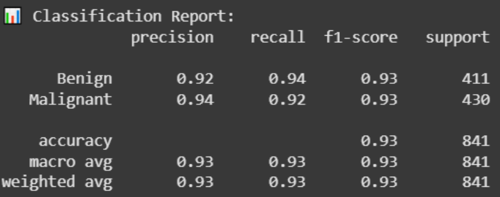

# 🩺 Breast-Cancer-Prediction-Using-Machine-Learning-Algorithms

## 📌 Overview
This project applies deep learning to breast cancer detection using MRI scans.
It evaluates ResNet-50 v2, Vision Transformers (ViT), and Kolmogorov–Arnold Networks (KAN), and explores Hybrid models (ResNet+KAN, ViT+KAN) to deliver accurate, interpretable, and scalable AI support for diagnosis.

By combining advanced architectures with KAN, the project focuses on not only high accuracy but also model explainability.

## Problem Statement

Breast cancer remains the most common cancer among women worldwide and one of the leading causes of death. Traditional diagnostic methods such as mammography, ultrasound, and biopsy suffer from significant limitations: they can produce false positives or false negatives, are invasive or highly operator-dependent, and often struggle in cases like dense breast tissue. While MRI offers higher sensitivity, it still requires computational support to reach its full potential. There is therefore a strong need for a reliable, non-invasive, and AI-based diagnostic approach that can improve both the accuracy and consistency of breast cancer detection while also providing interpretability to support clinical trust.

## 🎯 Objectives

The goal of this project is to design and evaluate deep learning models for early breast cancer detection using MRI scans. We set out to compare several advanced neural network architectures—including CNN, Vision Transformer (ViT), Kolmogorov–Arnold Networks (KAN), and ResNet—to determine their relative strengths. ,our work aims to enhance transparency and interpretability in model predictions. Ultimately, the objective is to deliver a system that reduces human error, assists healthcare professionals in decision-making, and demonstrates how AI can play a key role in improving early diagnosis and patient outcomes.

## 🛠️ Models Used

### 1️⃣ ResNet-50 + KAN
**ResNet-50** is a CNN-based model widely used for feature extraction in images. 
By fusing it with **KAN**, we gain **interpretability** through the spline-based network, which allows understanding how features contribute to the final decision. 
This hybrid ensures that while ResNet extracts powerful features from MRI scans, KAN provides transparency in predictions.

### 2️⃣ Vision Transformer (ViT)
**ViT** is a transformer-based architecture that captures **long-range dependencies** in images. 
It divides MRI images into patches and processes them with self-attention mechanisms, which is highly effective for medical images where local and global context matters.

### 3️⃣ ViT + KAN
The hybrid **ViT+KAN** combines the **feature extraction power of ViT** with the **interpretability of KAN**. 
This approach ensures high accuracy while providing insights into which patches and features contribute most to the model’s predictions.

## 📊 Results (All Models)

### 📈 Accuracy

### 🧮 Confusion Matrices

## 📊 Classification Report

## 📚 Dataset

A dataset containing 1,480 MRI images of breast cancer patients, classified into two categories: "healthy" and "diseased" (benign and malignant).

This dataset includes 40 images per category.

You can access the dataset here:

🔗 Breast Cancer Patients MRIs - Kaggle : https://www.kaggle.com/datasets/uzairkhan45/breast-cancer-patients-mris?

⚠️ Please note that the raw data is not uploaded to GitHub due to size and privacy restrictions.

## ⚙️ Installation

•	Clone the repository:

git clone https://github.com/username/breast-cancer-detection.git

cd breast-cancer-detection

•	Install dependencies:

pip install -r requirements.txt

## ▶️ Usage

Example training commands:

python vit_kan.py

python resnet_kan.py

## 🚀 Future Work

### Advanced Hyperparameter Tuning:

Explore spline degree, grid size, deeper widths, and regularization.

 ### Clinical Collaboration:

Compare predictions with radiologists.

Build trust for real-world clinical use.

### Explainability & Validation:

Visualize spline activations and feature importance.

Test models on external datasets (e.g., CBIS-DDSM).

 ### Clinical Deployment :

Optimize with ONNX, pruning, and quantization.

Compare predictions with radiologists for trust.

## 👨‍💻 Team

•	Alaa Qudah

•	Dana Freihat

•	Layan Al-Hiassat

•	Mai Al-Omari

